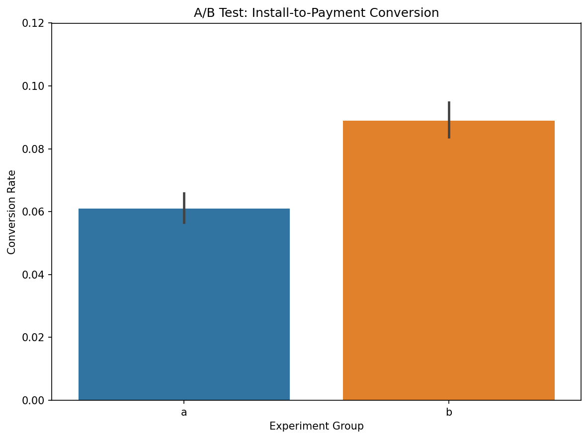

# A/B Testing: Subscription Conversion Analysis

## Project Overview

This project analyzes an A/B test evaluating whether a different subscription screen design affects the install-to-payment conversion rate.

The experiment tested a subscription screen presenting the standard price of **$4.99** as a **50% discount**.

## Business Question

Does presenting the subscription price as a discounted offer increase the install-to-payment conversion rate?

## Experiment

* **Control group (A):** Original subscription screen
* **Experiment group (B):** Screen presenting the subscription as a 50% discount
* **Test period:** July 3–25, 2023
* **Total users:** 19,998
* **Significance level:** 5%

## Results

| Metric          | Control (A) | Experiment (B) |
| --------------- | ----------: | -------------: |
| Users           |      10,013 |          9,985 |
| Conversions     |         611 |            889 |
| Conversion rate |       6.10% |          8.90% |

The experiment group had an observed relative conversion increase of approximately **46%** compared with the control group.

## Methodology

* Data validation and exploratory analysis
* Conversion-rate comparison
* Two-sample t-test
* Chi-square test of independence
* 95% confidence interval for relative conversion lift
* Data visualization with Python

## Visualization

## Tools & Libraries

Python · Pandas · NumPy · SciPy · Matplotlib · Seaborn

## Repository Structure

* `data/` — experiment dataset
* `notebooks/` — analysis notebook
* `plots/` — generated visualization

## Conclusion

The experiment group showed a higher observed install-to-payment conversion rate than the control group. Statistical testing is used to assess whether the observed difference is consistent with a difference between the groups.
